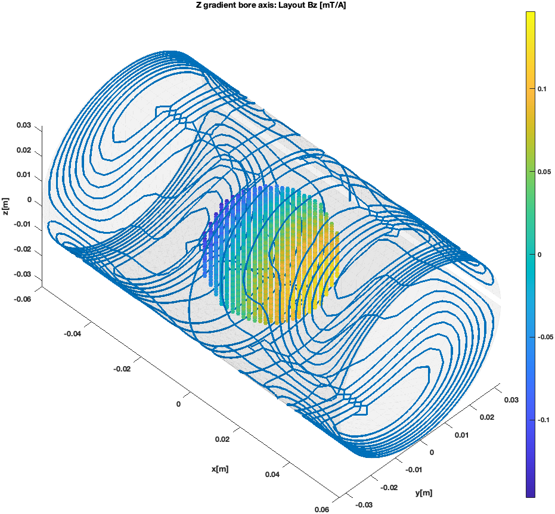
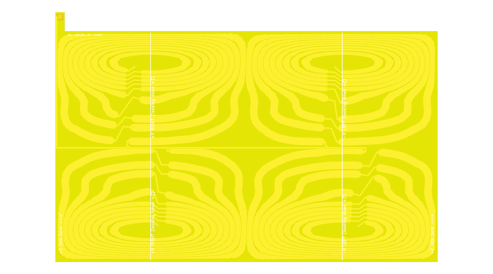
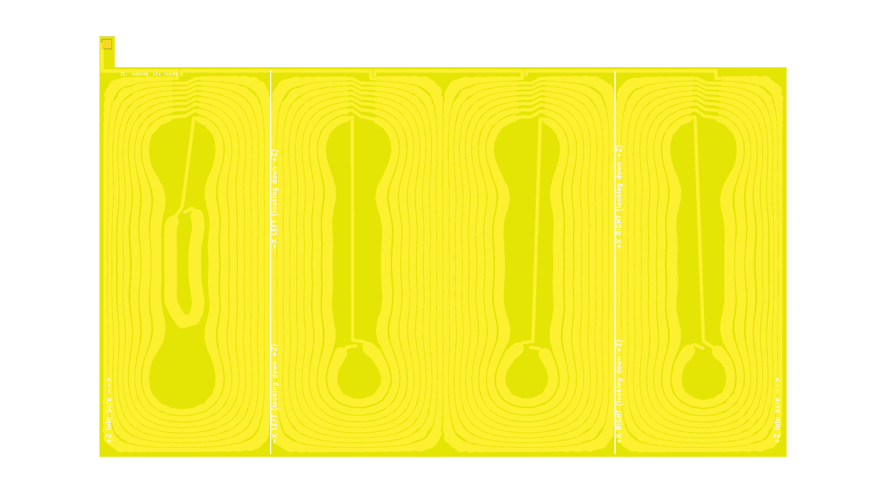
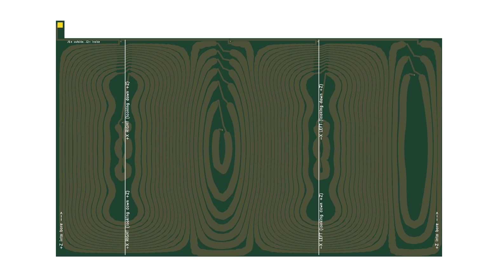

# Flex PCB gradient coils with CoilGen and KiCad

This guide covers the full workflow for building CoilGen coils as rolled 2-layer flex PCBs:

1. Design the coil on a cylinder with a slit (the seam of the rolled board).
2. Pick the manufacturer profile (stackup, limits, design values).
3. Export it as a KiCad board with both copper layers in series, the stackup and design rules included, plus a STEP model of the rolled board.
4. Check the board: KiCad's DRC, a same-net check the DRC can't do, and the manufacturer limits.
5. Read the board back into CoilGen and re-simulate the copper that will actually be made.
6. Look at the coils in 3D with CoilGen's plotting functions.
7. Build and align the coils.

The worked example is a 3-axis gradient set for a 45 mT Halbach magnet: `Examples/halbach_flex_pcb_gradient_set.m`. It runs steps 1–5 for all three coils.

| File | Purpose |
|---|---|
| `sub_functions/build_slit_cylinder_mesh.m` | Cylinder mesh with an axial slit (`'create slit cylinder mesh'`). |
| `sub_functions/export_kicad_flex_pcb.m` | CoilGen result → `.kicad_pcb` + `.kicad_pro`. |
| `sub_functions/import_kicad_flex_pcb.m` | `.kicad_pcb` → CoilGen result, re-evaluated with CoilGen's own field routines. |
| `sub_functions/strip_coilgen_result.m` | Keeps only the fields the plotting functions need, so a result can be saved compactly. |
| `Examples/halbach_flex_pcb_gradient_set.m` | Designs, exports, checks and re-simulates the Halbach gradient set. |
| `sub_functions/export_rolled_step.m` | STEP model of the board rolled onto its cylinder (board body, copper, silkscreen as separate colored bodies), zipped for git. |
| `sub_functions/rolled_flex_pcb_step.py` | Builds that STEP: reads the board with KiCad's Python module and wraps it onto the cylinder with OpenCASCADE. |
| `sub_functions/find_kicad_cli.m` | Locates KiCad's command-line tool. |
| `sub_functions/run_kicad_cli.m` | Runs `kicad-cli` (or Python) with a time limit (Java `ProcessBuilder`, not `system()`). |
| `sub_functions/check_kicad_flex_pcb.m` | Independent checks of a board file: KiCad DRC, same-net clearance, manufacturer limits, full-width field. |
| `Examples/check_flex_pcb_boards.m` | Runs those checks on the three boards. |
| `Examples/view_flex_pcb_coils.m` | 3D views and field plots of the re-simulated boards. |
| `KiCad_flex_PCBs/fab_profiles/` | Manufacturer profiles (JSON): stackup, fab limits and design values. `jlcpcb_flex_2layer_1oz_25um_0p2mm.json` is used for the example. |
| `KiCad_flex_PCBs/halbach_45mT_gradient_set/` | One KiCad project folder per coil, `coil_summary.txt` for the set. |

## Coordinate frames

CoilGen always optimizes the field component along its own `z` axis, so that axis has to be the main-field (B0) direction. In a Halbach magnet B0 runs across the bore, so the coil cylinder is rotated 90° about `y`. Its axis then lies along CoilGen's `x`.

| Magnet | CoilGen |
|---|---|
| `x` (B0; left → right looking down the bore) | `z` |
| `y` (down, looking down +z with +x to the right) | `-y` |
| `z` (down the bore) | `x` |

Each coil is the gradient of B0 along one magnet axis:
- the Z coil gives dBx/dz;
- the Y coil gives dBx/dy;
- the X coil gives dBx/dx.

CoilGen's plots use the CoilGen frame.

On the board, `x` is the arc length around the circumference and `y` is the axial position (+axial points up on the board). `F.Cu` is the outside of the rolled cylinder.

## 1. Design on a slit cylinder

When the rolled board closes into a tube, its two edges meet at a seam, and no track can cross it. The coil is therefore designed on a cylinder with a narrow axial slit. CoilGen never lets current cross a mesh boundary, so the optimizer itself keeps the seam free of current.

```matlab
coil_out=CoilGen( ...
    'field_shape_function','x', ...
    'coil_mesh_file','create slit cylinder mesh', ...
    'slit_cylinder_mesh_parameter_list',[length radius 60 40 0 1 0 pi/2 slit_angle slit_width], ...
    'surface_is_cylinder_flag',false, ...
    'skip_postprocessing',true, ...   % the exporter builds the wiring itself
    ... );                            % target region, levels, regularization as usual
```

`slit_cylinder_mesh_parameter_list` takes the same values as `cylinder_mesh_parameter_list`, plus two more:
- **`slit_angle`:** the slit centre in radians, as `atan2(y,x)` *before* the rotation is applied.
- **`slit_width`:** the arc width kept free of current, in meters (3 mm in the example).

**Where to put the slit.** Run the closed-cylinder design first, then take the angle where the largest `|stream_function|` along the axial line is smallest. In the example:
- **Z and Y:** both have such a line, at 1.5% and 0.4% of the peak, so the slit costs nothing.
- **X:** its best line still carries 23% of the peak, but the slit design kept the efficiency of the closed one.

Note that `CoilGen` removes `sub_functions` from the path when it returns. Run `addpath('sub_functions')` before calling the exporter or importer.

## 2. Manufacturer profile

The board is made for a specific flex process, described in a JSON profile under `KiCad_flex_PCBs/fab_profiles/`. The example uses `jlcpcb_flex_2layer_1oz_25um_0p2mm.json`, taken from [JLCPCB's flex capabilities](https://jlcpcb.com/capabilities/flex-pcb-capabilities) (checked 2026-10-05).

The profile has three parts:
- **`stackup`.** Coverlay (PI 25 µm + adhesive 25 µm), 35 µm (1 oz) copper, 25 µm polyimide core, 35 µm copper, coverlay, ENIG finish, 0.2 mm total. The board's KiCad stackup, its thickness, and the copper spacing used for the field and inductance (0.06 mm centre to centre) all come from here.
- **`fab_limits`.** JLCPCB's minimums:

  | Rule | Limit |
  |---|---|
  | Trace width and spacing (1 oz) | 4 mil (0.1016 mm) |
  | Trace width tolerance | ±20 % |
  | Via | 0.3 mm drill, 0.55 mm pad |
  | Via ring to trace | 0.1 mm |
  | Hole to copper | 0.2 mm |
  | Copper to edge | 0.3 mm |
  | Coverlay opening | 0.1 mm larger than the pad, ≥ 0.15 mm from traces |
  | Silkscreen | text ≥ 1 mm high, lines ≥ 0.15 mm, ≥ 0.15 mm from pads |
  | Board size | up to 234 × 490 mm |
  | Bend radius | ≥ 10 × thickness for 2 layers |

  These go into the `.kicad_pro` design rules.
- **`design`.** The values the exporter actually uses, with margin over the limits: 0.15 mm clearance (also the KiCad net-class clearance), 0.3 mm edge clearance, 0.6/0.3 mm vias.

Pass it to the exporter with `'fab_profile',file`. Options given explicitly still override the profile. After the export, every board is checked against the limits, and `report.fab_check` lists each rule with its value, its limit and whether it passes. For another manufacturer or stackup, copy the file and change the values.

## 3. Export to KiCad

```matlab
report=export_kicad_flex_pcb(coil_out,'my_coil.kicad_pcb','title','My coil', ...
    'positive_gradient',[1;0;0], 'axis_marks',{[0;0;-1],'-X LEFT'; [0;0;1],'+X RIGHT'}, 'axial_label','+Z into bore');
```

What the exporter builds:

- **Series 2-layer spirals.** Each group of nested contour loops becomes one spiral. It goes inwards on `F.Cu`, through one via inside the innermost turn, and back out on `B.Cu`. Both layers carry every turn, so the efficiency per ampere doubles compared with one layer.
- **No crossovers.** Each turn is opened over `cut_width`. The step to the next turn first crosses to that turn's opening, then follows the turn's own removed section into its start, so steps never run alongside a turn.
- **Inner via.** Each group's via is placed inside its innermost turn, as close to the opening as the clearances allow. Inner turns with no room for it are dropped and reported.
- **Routing channel.** The spirals open towards a copper-free axial band: a free band between the groups (the centre of the Z coil) or a margin beyond the end of the coil (X and Y). The groups are linked in series there on `F.Cu`, and a return trace runs back on `B.Cu` directly under the links. Each group's output continues right next to its input. Together this leaves no net circumferential current and almost no field from the wiring.
- **Feed tab.** A tab on the end edge of the board (the +axial end) sticks out past the end of the coil, so the rolled seam stays clean and there is room to solder the leads. It carries `J1` on `F.Cu` and `J2` on `B.Cu` directly behind it (a coaxial feed). The tab sits next to the seam, so the three coils' tabs end up at different angles. Feed and return run as a stacked pair (`F.Cu` over `B.Cu`) along the seam edge from the tab to the routing channel. With `positive_gradient` set, the pads are labelled `+`/`-` so that current into the `+` pad gives a positive gradient.
- **Variable trace width.** Each turn is cut into pieces of at most 1 mm, and each piece is made as wide as the space allows, up to `max_track_width`. The limits are:
  - the clearance to the neighbouring turns, which widen by the same rule;
  - the clearance to all fixed-width copper (steps, leads, links, ties, vias, pads);
  - the board edge;
  - the turn's own other parts where it comes back close to itself (narrow tips). Here the trace may even go below the base width.

  In the example this halves the resistance.
- **One net per turn.** Each turn on each layer is its own net, and consecutive turns are joined by KiCad net-tie footprints (`CoilGen:NetTie_Turn`). The DRC can therefore check the clearance between every pair of turns.
- **Silkscreen.** `axis_marks` draws an axial `F.SilkS` line where the rolled coil faces a given direction (for aligning it in the magnet). `axial_label` adds arrows for the axial direction.
- **Board setup and project file.** With a fab profile, the board gets its stackup (coverlay, copper, polyimide, ENIG, 0.2 mm) and the coverlay opening (`pad_to_mask_clearance`), and its vias are tented under the coverlay. The `.kicad_pro` gets the manufacturer limits as design rules, and the design clearance and via size as the net class.
- **Coordinate mapping.** The board-to-cylinder mapping is written into the title block (`CoilGen mapping: ...`), which the importer uses.

Exporter options (lengths in mm):

| Option | Default | Meaning |
|---|---|---|
| `track_width` | auto | Base trace width. Auto uses the smallest turn spacing minus the clearance. |
| `variable_width`, `max_track_width` | true, 4 | Widen each turn to the locally available space. |
| `clearance` | 0.15 | Copper clearance. Also written into the `.kicad_pro`. |
| `cut_width` | 6 | Length of the opening in each turn, where the spiral steps to the next turn. |
| `via_diameter`, `via_drill` | 0.6, 0.3 | Inner and link vias. |
| `edge_clearance` | 0.3 | Copper-to-edge clearance rule. |
| `seam_gap` | 0.5 | Gap between the two board edges at the seam once rolled. |
| `end_margin` | 1.5 | Board extension beyond the ends of the coil surface. |
| `tab_length`, `pad_size` | 10, 3 | Length of the feed tab past the end of the coil, and size of the solder pads. |
| `fab_profile` | '' | Manufacturer profile (JSON); sets the values below that aren't given explicitly, the stackup, the coverlay opening and the design rules, and the board is checked against it. |
| `copper_thickness` | 0.035 | Used for the resistance (1 oz = 0.035). From the profile if given. |
| `layer_gap` | 0.1 | `F.Cu`–`B.Cu` distance centre to centre, used for the field check. From the profile: dielectric + copper thickness. |
| `title`, `net_prefix` | | Board title and prefix for the net names. |
| `calc_inductance` | true | Filament (Neumann) inductance estimate. |
| `axis_marks` | {} | `{direction (3x1, coil frame), label; ...}`: alignment lines on `F.SilkS`. |
| `axial_label` | '' | Label with an arrow for the +axial board direction. |
| `positive_gradient` | [] | Gradient direction (3x1, coil frame) that counts as positive; sets the pad polarity labels. |

The `report` holds:
- the efficiency and gradient vector (mT/m/A) and the non-linearity, from Biot-Savart on the exported copper (both layers, links, subdivided onto the cylinder);
- the resistance and the track width minimum, mean and maximum;
- the smallest same-net gap;
- the inductance estimate, the turns per group and the number of dropped loops.

### STEP models

Each board folder has a 3D model of the board rolled onto its cylinder: `<coil>.step.zip`, which contains `<coil>.step`. It has four named, colored bodies:

| Body | What | Color |
|---|---|---|
| `Board` | the 0.2 mm board as a solid tube with the seam gap and the feed tab | yellow (coverlay) |
| `F.Cu` | copper on the outside (tracks and net ties) | copper |
| `B.Cu` | copper on the inside | copper |
| `F.SilkS` | silkscreen (alignment lines and text) | white |

Copper and silkscreen are surfaces, each layer merged into one body. As in KiCad's own STEP export they sit on the faces of the board body, which is centred on the middle of the copper stackup. Pads (the J1/J2 solder pads and the net-tie pads) and vias are left out; use `'include_pads',true` to keep the pads. The outlines are simplified to 0.02 mm (`'tolerance'`), well under the 0.15 mm clearance.

The coil diameter (65 / 70 / 75 mm) is the diameter of `F.Cu`. With the 0.2 mm stackup the board is about 0.25 mm smaller (ID) and 0.14 mm larger (OD), so the Z board is about 64.75 mm ID and 65.14 mm OD.

The example writes the models in the magnet frame (`'frame'`: bore along z, B0 along x), so the three files line up when you open them together: the coils nest at the right radii and the tabs come out of the +Z end at the angles in section 7. Each file is about 20 MB (about 4 MB zipped). Git keeps the zipped version and ignores the plain `.step`.

```matlab
export_rolled_step('KiCad_flex_PCBs/halbach_45mT_gradient_set/Z_gradient_bore_axis/Z_gradient_bore_axis.kicad_pcb', ...
    'frame',[0 0 1; 0 -1 0; 1 0 0]);   % CoilGen frame -> magnet frame
```

`rolled_flex_pcb_step.py` reads the board with KiCad's Python module (`pcbnew`, KiCad 8 or later), which merges the tracks of each layer and renders the silkscreen text. It then wraps each outline onto the cylinder. Every straight edge on the board becomes a helix on the cylinder, so the geometry is exact, not faceted. The cylinder (radius, seam angle, rotation) comes from the `CoilGen mapping` and `CoilGen cylinder` lines that `export_kicad_flex_pcb` writes into the title block.

It needs a Python with `cadquery-ocp`, `shapely` and `numpy`. `export_rolled_step` uses `.venv` in the CoilGen folder, or the Python given with `'python'` or in `COILGEN_PYTHON`:

```bash
python3.12 -m venv .venv      # cadquery-ocp has wheels up to Python 3.13
.venv/bin/pip install cadquery-ocp shapely numpy
```

It also runs on its own: `.venv/bin/python sub_functions/rolled_flex_pcb_step.py <board>.kicad_pcb [--frame ...] [--pads]`.

> **Regenerate the STEPs whenever a board changes.** That includes a re-export from CoilGen, a new fab profile, or an edit made in KiCad. `halbach_flex_pcb_gradient_set.m` exports them automatically after every board export. After a manual edit in KiCad, run `export_rolled_step` on the edited board, then commit the new `.step.zip` together with the `.kicad_pcb`.

## 4. Check the board

Each board is checked in several independent ways. `Examples/check_flex_pcb_boards.m` runs all of them on the `.kicad_pcb` files through `check_kicad_flex_pcb`. Because the checks read the board files themselves, they also cover anything edited in KiCad.

| Check | What it catches | Where |
|---|---|---|
| **KiCad DRC** | Shorts between nets, clearance between all nets (so between all turns), unconnected items (the series chain J1–J2), edge clearance, via and drill sizes, silkscreen size and clearance, coverlay openings | `kicad-cli pcb drc`, run by `check_kicad_flex_pcb` |
| **Same-net clearance** | A turn coming too close to itself, which the DRC can't see because it's one net | Exporter (`report.min_same_net_gap_mm`) and `check_kicad_flex_pcb` (from the file) |
| **Manufacturer limits** | Track width, clearance, vias, edge clearance, board size and bend radius against the fab profile | Exporter (`report.fab_check`) and `check_kicad_flex_pcb` |
| **Chain and polarity** | Branches, breaks or stray copper in the J1–J2 chain; whether J1→J2 gives the design polarity | `import_kicad_flex_pcb` (step 5) |
| **Field of the copper** | Efficiency, linearity and field error of the board copper, against the target and the ideal turns | Exporter (Biot-Savart) and `import_kicad_flex_pcb` (CoilGen's own routines) |
| **Full track width** | Whether the wide tracks change the field: each track is split into filaments across its width and compared with thin wires on its centre line | `check_kicad_flex_pcb` with `'coil_result'` |

**KiCad DRC.** It doesn't need a schematic, because every net is defined in the board file. With a fab profile, the `.kicad_pro` holds the manufacturer's limits as rules, and the design clearance and vias as the net class. To confirm that DRC really applies the project rules, run it on a copy of a board with an impossible rule (for example `min_track_width` = 5 mm). It then reports track-width violations; with the real rules it reports none. To run the DRC on its own:

```bash
cd KiCad_flex_PCBs/halbach_45mT_gradient_set
for f in */*.kicad_pcb; do kicad-cli pcb drc --severity-all -o "${f%.kicad_pcb}_drc.rpt" "$f"; done
```

**Same-net clearance.** KiCad doesn't check clearance *within* a net. A turn that came too close to itself (in a narrow tip, for example) would short part of the turn without any DRC error. The exporter narrows turns where this would happen, even below the base width, and reports the smallest same-net gap, warning when it's below the clearance. `check_kicad_flex_pcb` measures it again from the board file: it samples all tracks every 0.05 mm and compares parts of a net that are far apart along the track.

**Full track width.** The re-simulation (step 5) models every track as a thin wire along its centre. Splitting each track into 7 filaments across its real width changes the gradients by less than 0.1 % and the field by less than 0.05 % of its range, so the wide tracks don't affect the field. The current stays centred because the tracks widen symmetrically, and the copper is at least 12.5 mm from the target region.

**Results for the example boards:**
- **KiCad DRC:** 0 violations and 0 unconnected items on all three.
- **Same-net clearance:** at least 0.15 mm.
- **JLCPCB profile:** every limit met.
- **Re-simulation:** matches the design, and J1→J2 has the design polarity on all three.

## 5. Re-simulate the manufactured copper

```matlab
[pcb_out,pcb_check]=import_kicad_flex_pcb(coil_out,'my_coil.kicad_pcb');
```

The importer reads the board file itself (tracks, vias, net ties, pads) and follows the copper from `J1` to `J2`. It stops with an error if the chain branches, breaks, or leaves copper unused. It maps the path back onto the cylinder: `F.Cu` outside, `B.Cu` one `layer_gap` inside. The path then becomes the coil's `wire_path`, and CoilGen's own `evaluate_field_errors` and `calculate_gradient` evaluate it.

Because the board file is read, the result reflects the copper as it will be made, including any edits done in KiCad.

**Like-for-like comparison.** Both layers carry every turn, so the ideal reference is the same turns as closed loops on *both* layers. The importer adds the second-layer copy of the contour loops and halves the contour step, so that each ampere in the board counts as two steps of the stream function. The error metrics then compare like with like:
- **`layout`:** the board copper, against the target field;
- **`unconnected contours`:** the ideal closed turns on both layers, against the target field.

`pcb_out` has the same fields as a CoilGen result, so the functions in `plotting` work on it. `pcb_check` holds the number of segments, ties and vias, the copper length, the resistance from the actual trace widths, the gradient (mean and spread over the target region), CoilGen's error values, and whether current from J1 to J2 has the design polarity.

## 6. View the coils in 3D

`halbach_flex_pcb_gradient_set.m` saves a compact copy of each re-simulated result next to its board (`<coil>_coilgen_pcb.mat`, about 3 MB). To open the 3D views and field plots of all three coils without rerunning the design, run this in the MATLAB desktop:

```matlab
cd Examples
view_flex_pcb_coils
```



The views show the actual PCB copper: the spirals with their steps between turns, the link ring and the seam. The field shown is the one this copper produces in the target region. In the 3D views, `plot_slit_seam` marks the seam (the slit where the rolled board's edges meet) as a red strip labelled "seam (PCB split)". You can call it after any 3D plot of a slit-cylinder coil: `plot_slit_seam(coil_layouts,1)`. Rotate the views with the rotate tool in the figure toolbar.

## Example results

All values are for the JLCPCB profile (1 oz copper, 25 µm polyimide, 0.2 mm) and 0.15 mm clearance, with variable trace width up to 4 mm. The inductance is a filament estimate (±15%), and V (L) is the voltage across it for a 100 µs ramp. The ±20 % trace width tolerance means the real resistance can be about −17 % / +25 % off the nominal value. All three boards meet every limit in the profile.

The coils are 120 mm long (the board is about 123–125 mm), centred on the 40 mm target region.

**24 V check (Z, the most demanding axis).** Nominal: 16.1 V + 2.7 V (100 µs ramp) ≈ 18.8 V. Worst case, with +25 % resistance from the trace width tolerance and the copper 30 °C warm (R ≈ 5.9 Ω): 22.6 V + 2.7 V ≈ 25.3 V. That is slightly over 24 V; a 150 µs ramp or 2 oz copper brings it back under. X and Y need about 4–5 V in all cases.

| Coil | Diameter | Track min/mean/max | Turns (both layers) | Efficiency | Non-linearity, 40 mm DSV | R | L | Current for target | V (R) | V (L) | Peak power |
|---|---|---|---|---|---|---|---|---|---|---|---|
| Z (bore axis), 28 mT/m | 65 mm | 0.70 / 1.54 / 4.0 mm | 72 | 7.34 mT/m/A | 0.69 % | 4.2 Ω | 72 µH | 3.81 A | 16.1 V | 2.7 V | 62 W |
| Y, 12 mT/m | 70 mm | 1.05 / 1.82 / 4.0 mm | 72 | 17.9 mT/m/A | 0.70 % | 5.1 Ω | 139 µH | 0.67 A | 3.4 V | 0.9 V | 2.3 W |
| X (B0 axis), 12 mT/m | 75 mm | 1.05 / 2.19 / 4.0 mm | 62 | 14.0 mT/m/A | 0.16 % | 3.7 Ω | 115 µH | 0.86 A | 3.2 V | 1.0 V | 2.7 W |

CoilGen re-simulation of the copper read back from the boards. The field errors are the deviation from the target field, relative to its maximum; "ideal" means the same turns as closed loops on both layers.

| Coil | Gradient (mean ± spread) | R from board | Field error, board copper (max / mean) | Field error, ideal turns (max / mean) | J1→J2 |
|---|---|---|---|---|---|
| Z | 7.34 ± 0.05 mT/m/A | 4.23 Ω | 1.37 / 0.37 % | 1.33 / 0.31 % | design polarity |
| Y | 17.88 ± 0.19 mT/m/A | 5.05 Ω | 2.70 / 0.69 % | 0.79 / 0.19 % | design polarity |
| X | 14.03 ± 0.03 mT/m/A | 3.73 Ω | 0.61 / 0.23 % | 0.68 / 0.30 % | design polarity |

The wiring adds almost nothing to the Z and X coils. On the Y coil, the extra error comes from 4 small loops that sat as side branches inside other turns. They can't be reached on two layers, so the exporter dropped them (see Limitations).

**Why Z needs the most power.** With the main field across the bore, a gradient along the bore can't use a Maxwell-pair-like layout, so it's built from four saddle-shaped groups. At a fixed gradient the power doesn't depend on the number of turns: fewer turns lower the voltage but raise the current by the same factor. Only these reduce the power:
- more copper: wider traces (as done here) or thicker copper (2 oz halves the resistance again);
- a lower gradient;
- a longer coil.

Renders of the top side (`F.Cu`):





## 7. Building the coils

- The boards are made for JLCPCB flex: 2 layers, 1 oz copper, 25 µm polyimide, 0.2 mm, ENIG, yellow coverlay. The KiCad stackup and design rules match, and all limits are met. For another manufacturer, make a new profile (see section 2) and re-export.
- Optional: order a 0.2 mm PI stiffener under the solder tabs (JLCPCB offers it), so the tabs stay flat while soldering.
- Roll each board with `F.Cu` outside. The two seam edges meet with a `seam_gap` gap, and no track crosses the seam. The rolled boards are about 123–125 mm long, plus the 10 mm feed tab sticking out of the +Z end (to about +72–73 mm from the coil centre).
- Turn each rolled coil so that, looking down the bore in +Z (B0 from left to right):
  - the `-X LEFT` silkscreen line sits at the left side of the bore;
  - the `+X RIGHT` line sits at the right side;
  - the `+Z into bore` arrows point down the bore.
- Solder the leads to `J1` (outside face of the tab) and `J2` (inside face), and twist them. Current into the pad marked `+` gives a positive gradient; on the Y coil that is `J2`.
- **Tab and seam angles.** These are measured counterclockwise from the +X line, as seen from the +Z end (where the tabs come out) with +X to the right and +Y up. Viewed from the −Z end, use 360° − θ. Each tab starts at its coil's seam edge and is 5 mm wide.

  | Coil | Diameter | Seam gap | Tab |
  |---|---|---|---|
  | Z | 65 mm (inner) | 269.6°–270.4° | 270.4°–279.3° |
  | Y | 70 mm (middle) | 89.6°–90.4° | 90.4°–98.6° |
  | X | 75 mm (outer) | 294.6°–295.4° | 295.4°–303.0° |

  None of the tabs overlap. Leave 1–2° of clearance on each side of any opening for the tabs.
- Nest the coils: Z (65 mm) inside, then Y (70 mm), then X (75 mm), 2.5 mm apart radially. Line up the axial centres.

## Limitations

- Only single-part coils designed on a `'create slit cylinder mesh'` surface are supported.
- When a loop contains more than one nested set of loops, only the largest branch is kept, and the others are dropped with a warning. These small side-branch loops can't be reached on two layers. The re-simulation shows their effect: about 2.4 % more maximum error on the Y coil.
- Inner turns with no room for the via are dropped and counted in `report.dropped_loops`.
- The inductance is an estimate (±15%), not a FastHenry result. The inter-layer capacitance, and so the self-resonance, isn't calculated. Measure the self-resonance once a coil is built, and check it is well away from your RF frequency.
- The importer expects boards written by `export_kicad_flex_pcb`: it needs the mapping in the title block and the `CoilGen:NetTie_Turn` and `CoilGen:SolderPad` footprints. Tracks you edit or add in KiCad are fine, as long as the copper stays one chain from J1 to J2.
